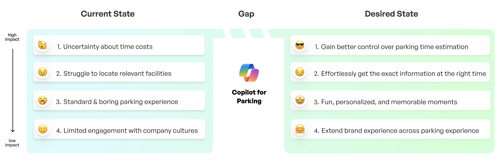
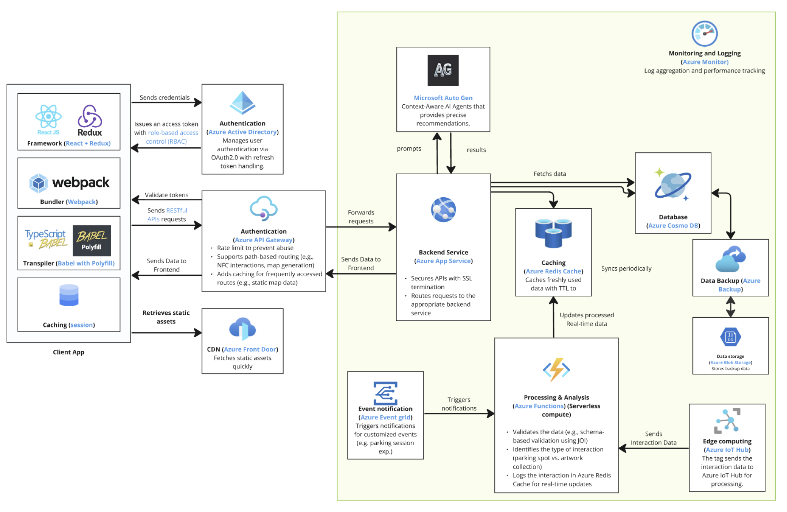
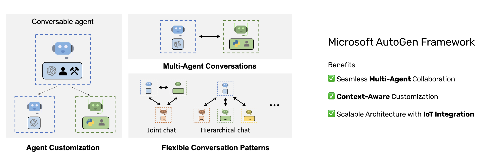

# Copolit Parking
Copilot for Parking transforms current parking challenges into seamless, personalized, and brand-aligned experiences that meet user needs and elevate satisfaction.

## System Architecture

## Ai Agent Microservices

### Contributors

This project exists thanks to all the people who contribute. 

## License

[MIT](LICENSE) © UW Cohort 7 PGX